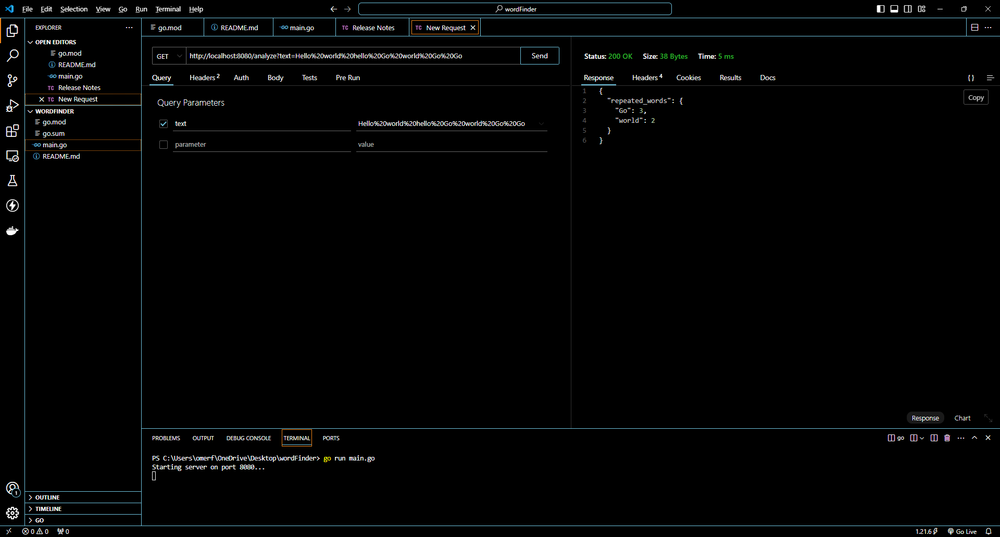

The code performs the following functions:

Provides an analysis function to analyze the incoming text.
Handles both JSON-formatted POST requests and GET requests.
Returns a JSON response containing the count and list of repeated words.